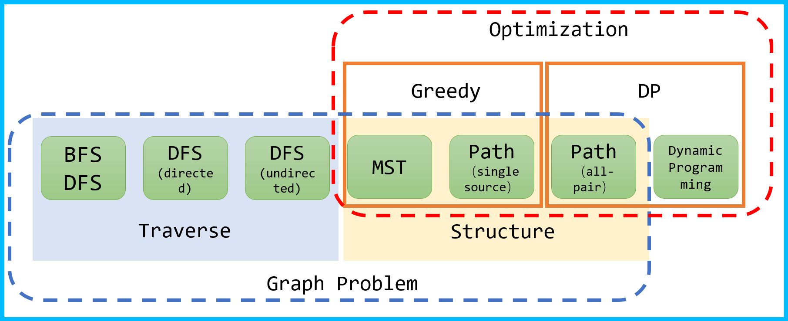
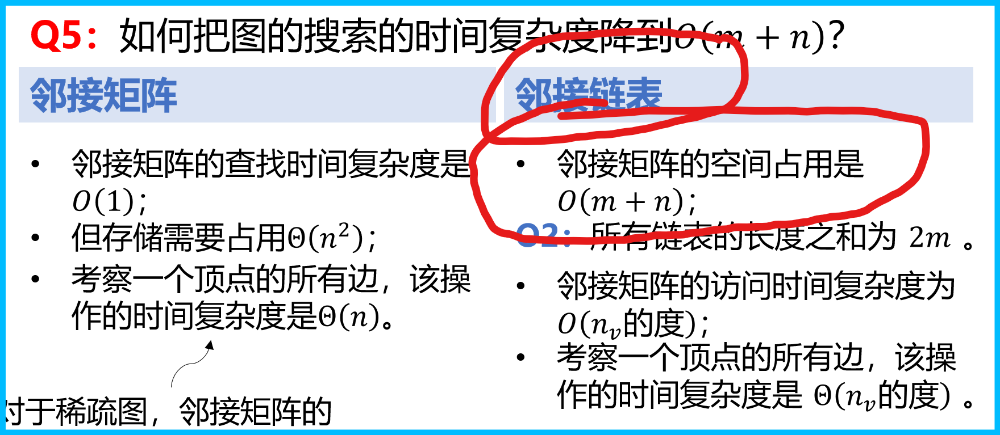

# 第七周笔记

从本周开始, 学习内容核心从"序"转移到"优化"

- 图的基本概念的复习  
链表和邻接矩阵分别求节点度数的方法  
树就是没有环的图 (无环连通图)
- 序 (order) 的概念: 就是先后, 人为定义  
无向图中不便于判断上下左右

## 图的常见问题

1. 路径和简单路径和最短路径
2. 连通性
3. 

## 图的遍历

- 树: 递归调用 或者 存栈 或者 染色
- 深度优先遍历

- testing vscodeweb on android edge broswers