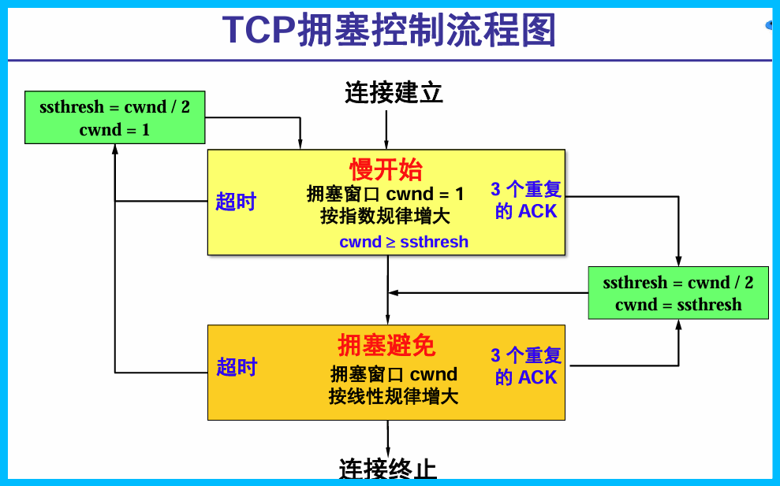

# 计算机网络

## 第六周

### 运输层-传输控制协议TCP-利用可变窗口

滑动窗口既可以进行流量控制, 而也可以用于实现可靠传输.  
窗口宽度以字节衡量.

### DNS实验

- 使用winserver配置
- 在本地搭建DNS服务器，进行域名解析

## 第七周

### 传输层-拥塞控制

- 一般原理: 所需资源 $>$ 可用资源  
    开环控制(事先考虑所有可能引起拥塞的因素)  
    闭环控制(基于反馈: 检测-传送信息-调整)
- 检测指标: 被丢弃的分组数, 平均队列长度, 超时重传分组数, 平均分组时延, 等等
    $真正的发送窗口值=min(公告窗口, 拥塞窗口)$
    $发送窗口的上限值=min(接收方窗口, 拥塞窗口)$

- **慢开始(Slow start)**  
    算法的思路：由小到大逐渐增大拥塞窗口数值。  
    初始拥塞窗口cwnd设置：为1 至2 个发送方的最大报文段SMSS (Sender Maximum Segment Size) 的数值。新的RFC 5681 把初始拥塞窗口cwnd设置为不超过2至4个SMSS 的数值.  
    拥塞窗口cwnd每次的增加量= min (N, SMSS).  
    慢开始门限ssthresh的用法如下：
  - 当cwnd< ssthresh 时，使用慢开始算法。
  - 当cwnd> ssthresh 时，停止使用慢开始算法而改用拥塞避免算
法。
- **拥塞避免**  
    cwnd缓慢地增大，即每经过一个往返时间RTT 就把发送方的拥塞窗口cwnd加1，而不是加倍，使拥塞窗口cwnd按线性规律缓慢增长。  
- **重传定时器超时**  
    用于判断到网络出现拥塞时.  
  1. ssthresh = max(cwnd/2，2)
  2. cwnd = 1
  3. 执行慢开始算法
- **三个重复确认**  
    知道接收方确实没有收到报文段，因而应当立即进行重传（即“快重传”），这样就不会出现超时，发送方也不就会误认为出现了网络拥塞.
  - 执行快恢复算法FR (Fast Recovery) 算法：
  1. 慢开始门限ssthresh = 当前拥塞窗口cwnd/ 2 ；
  2. 新拥塞窗口cwnd= 慢开始门限ssthresh；
  3. 开始执行拥塞避免算法，使拥塞窗口缓慢地线性增大

### 网络层-概述

连接主机到主机(典型设备包括路由器)  
**功能:**

1. **转发**: move packets from router's input to appropriate output
2. **路由**: determine route taken by packets from source to dest
3. 链接管理: 数据报服务无连接, 虚电路等网络面向连接

>why the slides from our teacher suddenly changed into english ???, i mean, we are all Chinese.
